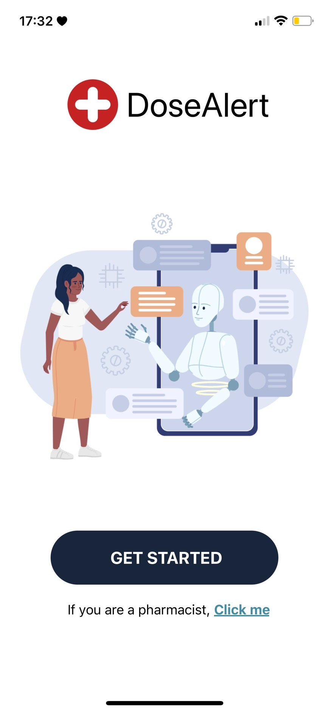
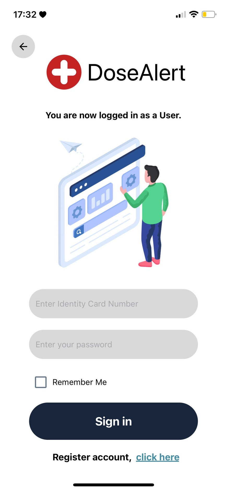
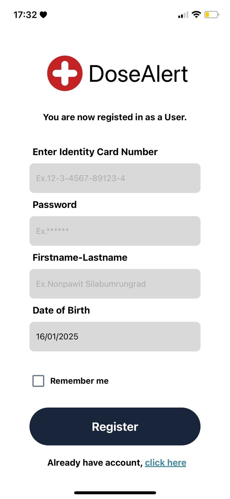
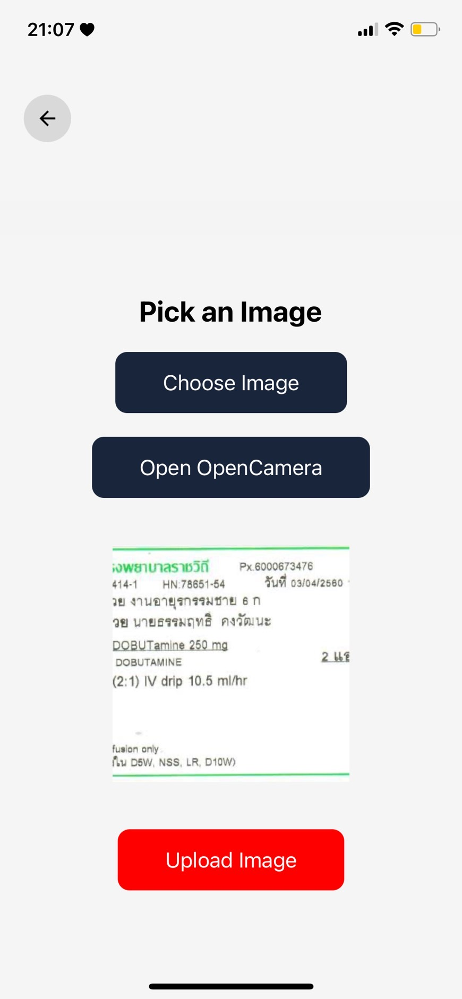
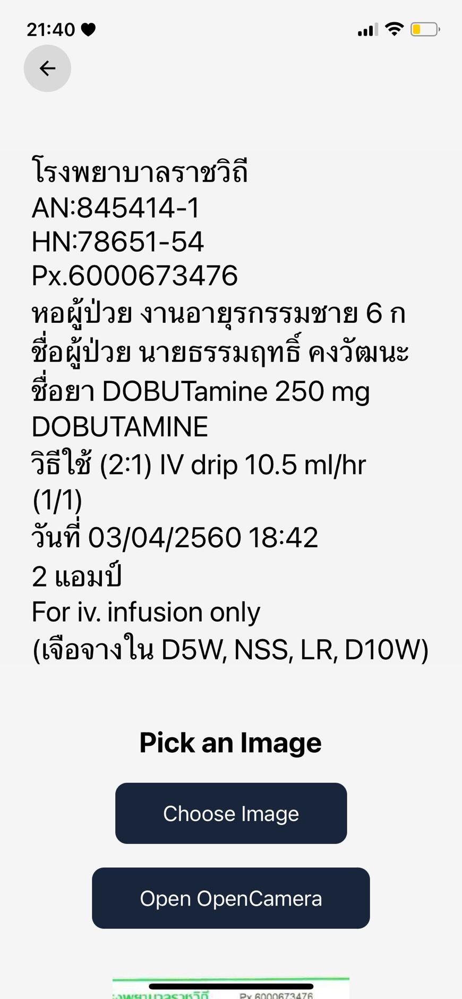

# MEDICINE-SCAN-APP 📱💊

## Description 📝
This mobile application leverages the Google Vision API's OCR technology to scan and extract detailed drug information from medication labels. 🤖📱 It includes a custom-trained Language Learning Model (LLM) designed for pharmaceutical-specific 
Q&A, enabling users to get accurate and instant answers to their medication-related queries. 🧠💬 This app aims to improve medication management and provide accessible pharmaceutical knowledge at your fingertips.

## Features 🛠️
- Medication Label Scanning 📄💊
    - Utilizes OCR technology to extract detailed information from medication labels, such as the drug name, ingredients, recommended dosage, and expiration date.
- Pharmaceutical Q&A 🧠💬
    - Uses a custom-trained LLM to provide accurate answers related to pharmaceuticals, such as
        - How to use the medication
        - Possible side effects
        - Drug interactions
- Medication Reminder ⏰
    -  A reminder system to notify users when it’s time to take their medication, ensuring they don't forget.
- Medication Record Management 💾 
    - Keeps track of the user's medication history and records.
    - Allows users to add or update their medications.

## Technologies Used ⚙️
- JavaScrip
- Node.js Express
- OCR tecnology
- LLM
- PostgreSQL

## Screenshots 📸
### The startup screen of the application 🌟📱✨

 

### The login screen 🔐💻

  

### The register screen 📝🎉

 

### The homepage 🏠✨

 

### The screen for selecting an image or opening the camera to call the OCR API and extract text 📸📝🔍

 

### The screen displaying the text extracted from the image by OCR 📜🔠

## Author ✍️
- Deverlop by Natchanan and Nonpawit 